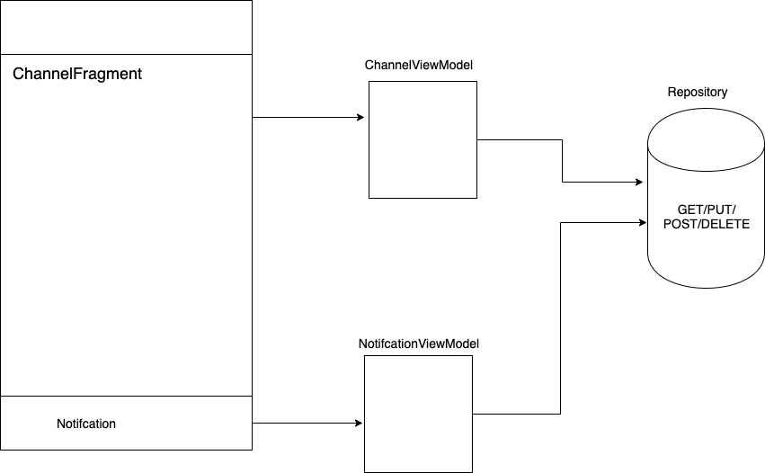

# AT&T Coding Challenge

__Prompt__ - Build an app that shows three channels with TV Shows. Allow the user to record from any of the channels.

__Purpose__ - Showcase the use of Model - View - ViewModel with RxJAVA in Android.

Features not added was Dagger2, JUnit4 Tests and Instrumentation tests.

## Architecture

Showcasing the seperation between Notification and ChannelFragment

## End Result

End result using mock data

## Contributing
This was a coding challenge issued from AT&T on 3/20/2019 for the position Android Engineer. There will be no more contribution to this project after 3/27/19

## License
[MIT](https://choosealicense.com/licenses/mit/)